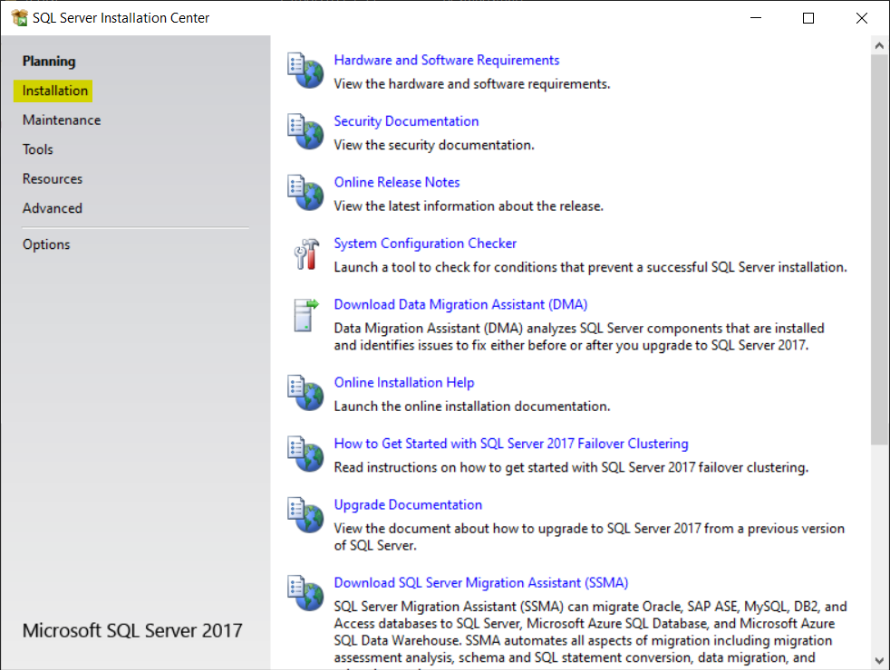
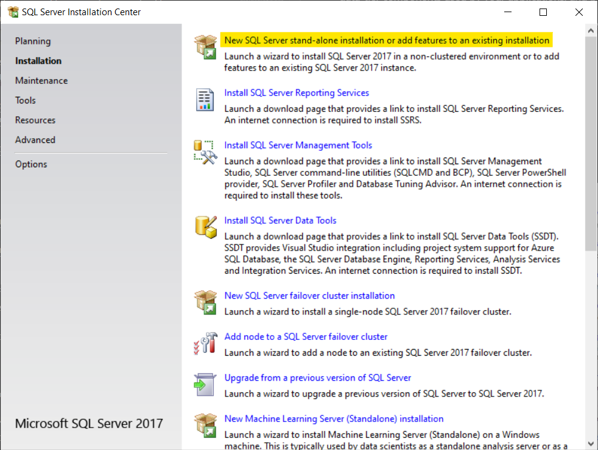
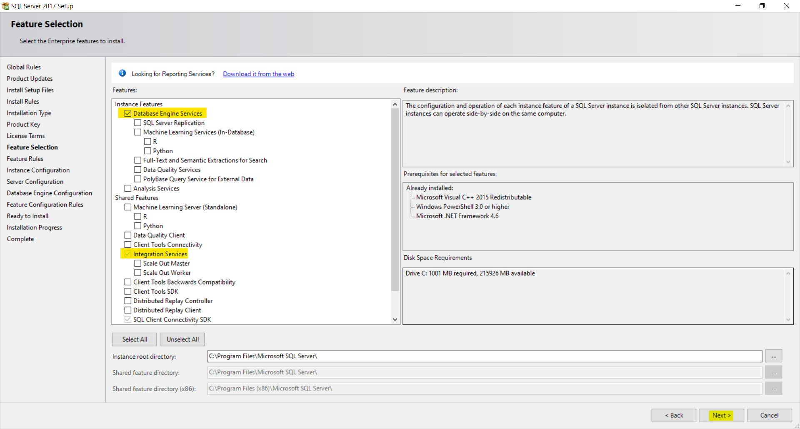
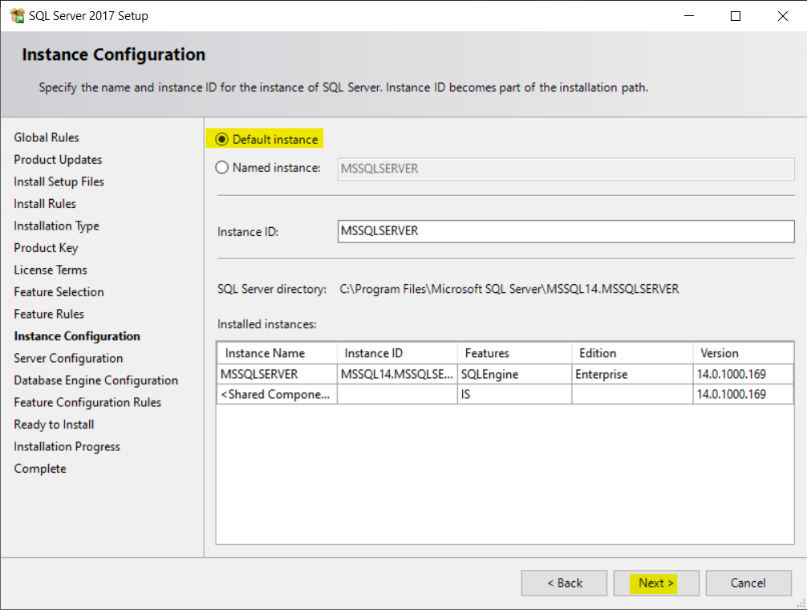
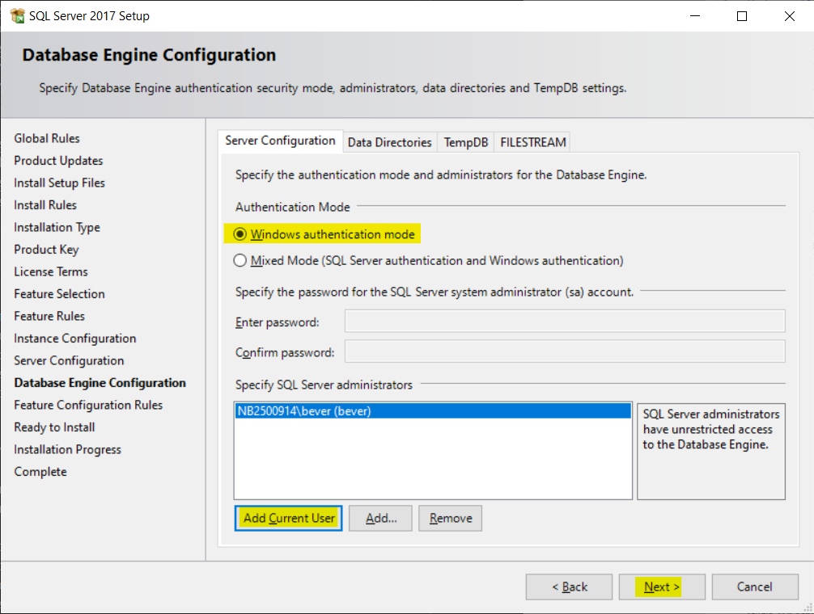
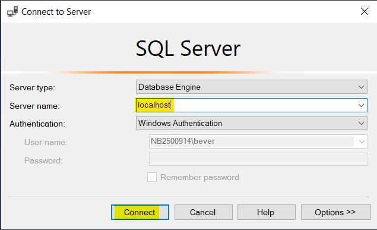
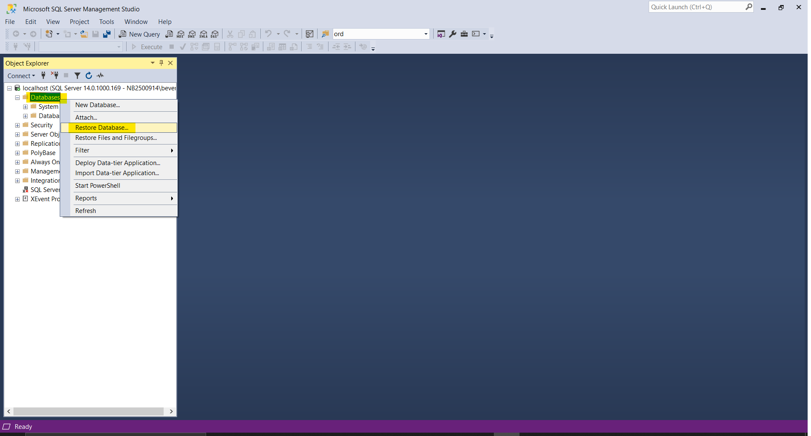
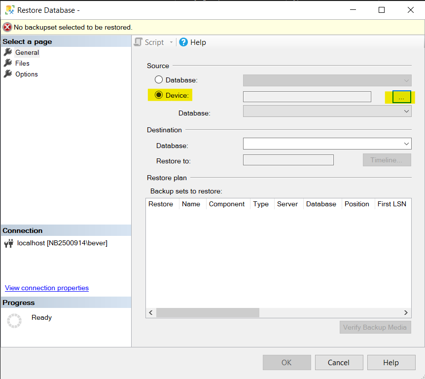
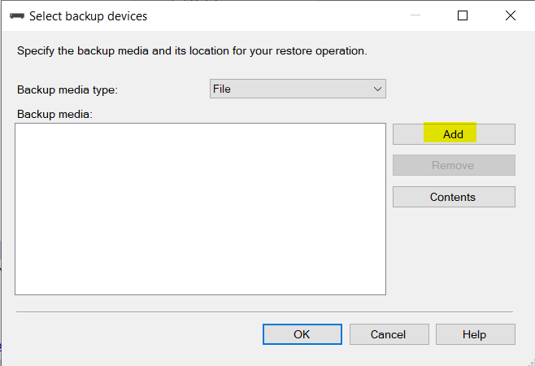
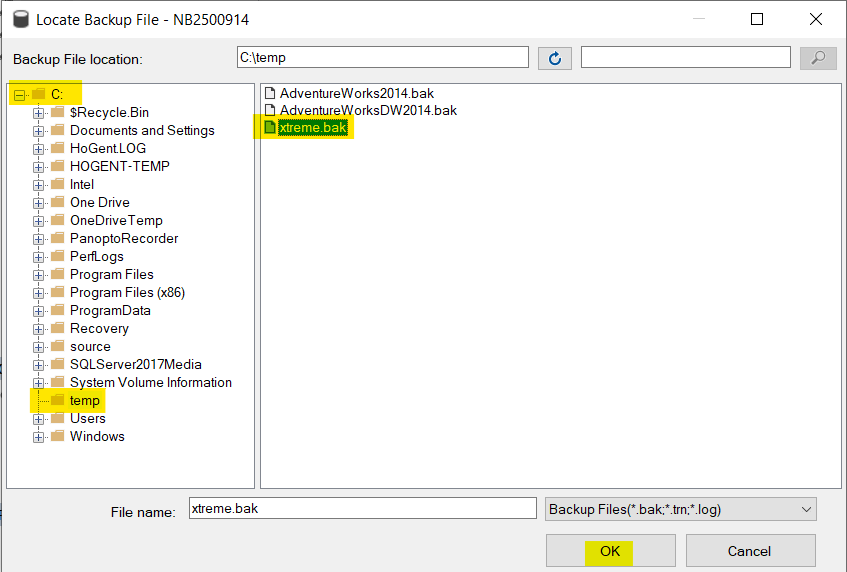

# Databases II - Workshops

## Installation Guide
To start any workshop, you need atleast all the required software and required databases. 

### Windows Users
Follow the steps **sequentially** to get started.
1. [SQL Server 2017](#sql-server-2017)
2. [SQL Server Management Studio (SSMS)](#sql-server-management-studio-SSMS)
3. [SQL Server Data Tools (SSDT)](#sql-server-data-tools-SSDT)
4. [Databases](#required-databases)

The following software is not required but can be useful.
- [Azure Data Studio](#azure-data-studio)

### MAC | Apple Users
If you're a MAC or Apple user, we recommend using a VM or another way to run Windows on your device. However you can also follow [this unsupported guide](https://database.guide/how-to-install-sql-server-on-a-mac/), which will install SQL Server 2017(step 1) in a docker container. As an alternative client for step 2 we recommend [Azure Data Studio](#azure-data-studio). Afterwards install the [required databases](#required-databases) (step 4).
> Note that we do **not** support this setup and have no alternative for step 3 (SSDT).

---

### Required Software
#### SQL Server 2017
##### Download
In the workshops you require the "Enterprise Edition" of SQL Server, which is a paid licence. The licenced installer can be downloaded through [this secured link on Chamillo](https://chamilo.hogent.be/index.php?go=CourseViewer&application=Chamilo%5CApplication%5CWeblcms&course=33277&tool=Link&browser=List&tool_action=Viewer&publication=1538114).

##### Installation
1. Mount the `.iso` file and open the `setup.exe`
2. Click installation
    
3. Click new SQL Server stand-alone installation...
    
4. Click next a few times and agree to the license terms.
5. Make sure the following features are selected and click next.
    - Database Engine Services
        > **REMARK:** If you already have a Database Engine installed (by following another course e.g. Web Applications 3), you **must** leave this feature **unchecked**.
    - Integration Services

    
6. Leave the default instance and click next.
    
7. Click next when asked about service accounts.
8. Make sure:
    - Windows Authentication Mode is checked
    - Click the button Add Current User to add yourself as SQL Administrator

    
9. Finally, click Install.

---

#### SQL Server Management Studio (SSMS)
SQL Server Management Studio (SSMS) is an integrated environment for managing any SQL infrastructure, from SQL Server to Azure SQL Database. SSMS provides tools to configure, monitor, and administer instances of SQL Server and databases. Use SSMS to deploy, monitor, and upgrade the data-tier components used by your applications, and build queries and scripts.

Use SSMS to query, design, and manage your databases and data warehouses, wherever they are - on your local computer, or in the cloud. [Learn More](https://docs.microsoft.com/en-us/sql/ssms/download-sql-server-management-studio-ssms?view=sql-server-ver15).

##### Installation
1. [Download](https://aka.ms/ssmsfullsetup) the installer.
2. Install using the default setup.

---

#### Sql Server Data Tools (SSDT)
SQL Server Data Tools (SSDT) is a modern development tool for building SQL Server relational databases, Azure SQL Databases, Analysis Services (AS) data models, Integration Services (IS) packages, and Reporting Services (RS) reports. With SSDT, you can design and deploy any SQL Server content type with the same ease as you would develop an application in Visual Studio. [Learn More](https://docs.microsoft.com/en-us/sql/ssdt/sql-server-data-tools?view=sql-server-ver15)

##### Installation
There are subtle differences between Visual Studio 2017 and 2019, use the correct installation guide:
- [Visual Studio 2017](https://docs.microsoft.com/en-us/sql/ssdt/download-sql-server-data-tools-ssdt?view=sql-server-ver15)
    - Additionally install the Integration Services by using the stand-alone installer which can be found [here](https://go.microsoft.com/fwlink/?linkid=2110080)
- [Visual Studio 2019](https://docs.microsoft.com/en-us/sql/ssdt/download-sql-server-data-tools-ssdt?view=sql-server-ver15#ssdt-for-visual-studio-2019)
    - Additionally install the Integration Services by installing the extension which can be found [here](https://marketplace.visualstudio.com/items?itemName=SSIS.SqlServerIntegrationServicesProjects).

---

### Required Databases
There are multiple databases required for the workshops. You'll be restoring the databases on your freshly installed SQL Server by following the steps below.
1. Download the following databases:
    - [Xtreme](https://github.com/HOGENT-Databases/DB2-Workshops/raw/master/databases/xtreme.bak)
    - [Tennis](https://github.com/HOGENT-Databases/DB2-Workshops/raw/master/databases/tennis.bak)
    - [Adventure Works](https://github.com/Microsoft/sql-server-samples/releases/download/adventureworks/AdventureWorks2014.bak)
    - [Corona](https://github.com/HOGENT-Databases/DB2-Workshops/raw/master/databases/corona.bak)
2. Copy all the databases above to the `C:\Temp` folder, if the folder does not exist, create it. 
    > **Remark:** do **not** skip this step.
2. Open SQL Server Management Studio and connect to `localhost`.

    
3. Right click `Databases` in the object explorer and select `Restore Database...`.

    
4. Select `Device` and press the `...` button

    
5. Click `Add`

    
6. Locate the `C:\Temp` folder and **click** it, select a `database.bak` file, click `OK`.

    
7. Click `OK`
8. Repeat step 3-7 for every database mentioned above.

---

### Optional Software
#### Azure Data Studio
Previously released under the name of SQL Operations Studio, Azure Data Studio offers a modern editor experience for managing data across multiple sources with fast intellisense, code snippets, source control integration, and an integrated terminal. Azure Data Studio is engineered with the data platform user in mind, with built-in charting of query result-sets and customizable dashboards.

Azure Data Studio is complementary to SQL Server Management Studio with experiences around query editing and data development, while SQL Server Management Studio still offers the broadest range of administrative functions, and remains the flagship tool for platform management tasks. 

Azure Data Studio will continue to be updated on a monthly basis and currently offers built-in support for SQL Server on-premises and Azure SQL Database, along with preview support for Azure SQL Managed Instance, Azure SQL Data Warehouse, and SQL Server 2019 Big Data. [Learn More](https://docs.microsoft.com/nl-nl/sql/azure-data-studio/what-is?view=sql-server-ver15)