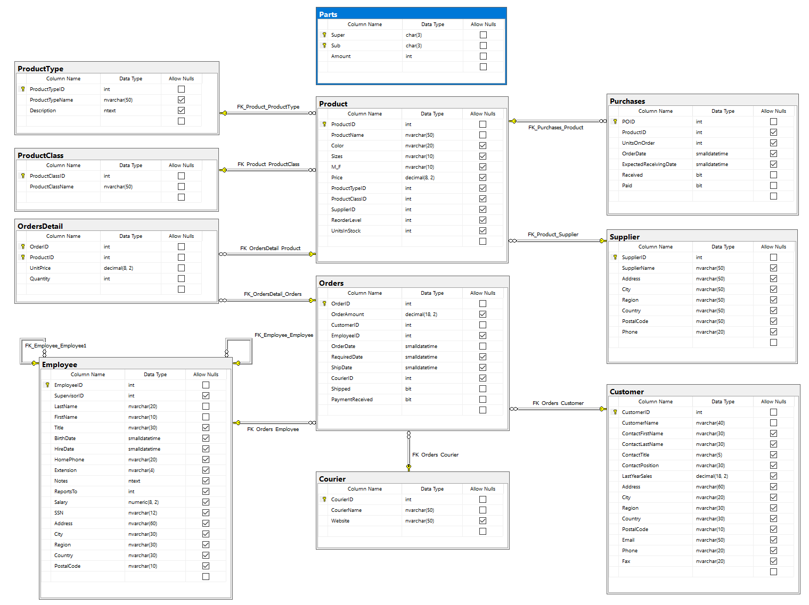
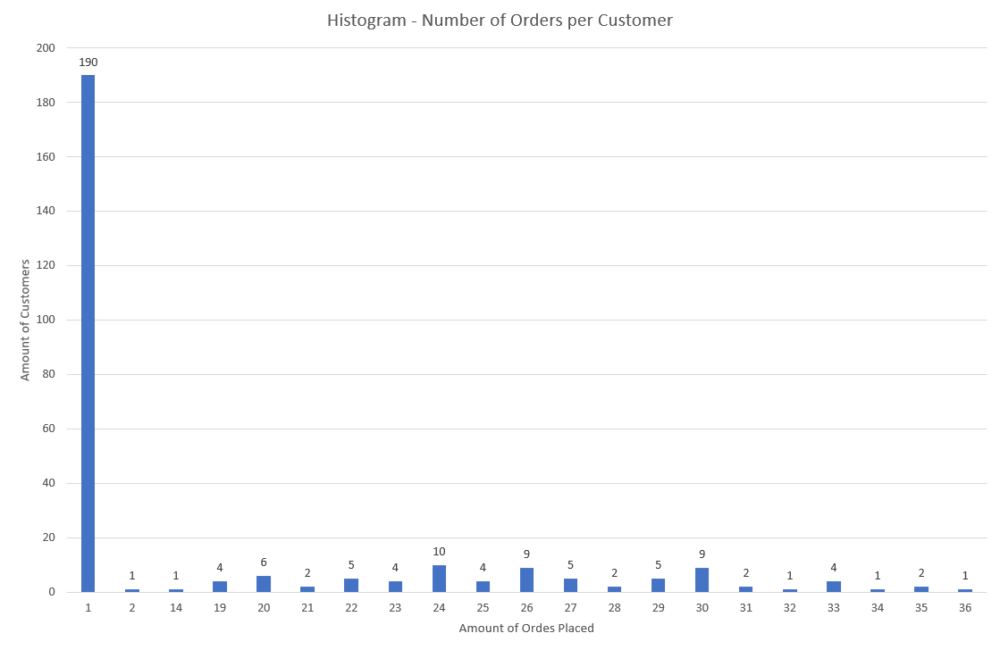

# Workshop - **C**ommon **T**able **E**xpressions
In this workshop you'll learn how to re-use result sets in other result sets using Common Table Expressions the statement in scope is `WITH`. The dataset you'll be using is `Xtreme`.

## Prerequisites
- SQL Server 2017+ Installed;
- **S**QL **S**erver **M**anagement **S**tudio Installed;
- A running copy of the database **xtreme**.
    > You can download the database by using [this link](https://github.com/HOGENT-Databases/DB2-Workshops/raw/master/databases/xtreme.bak), information on how to restore a database can be found [here](https://docs.microsoft.com/en-us/sql/relational-databases/backup-restore/restore-a-database-backup-using-ssms?view=sql-server-ver15).

## Getting started
1. Execute the following script, which will create a new table called `Parts` and insert some dummy data:
    ```sql
    CREATE TABLE Parts 
    (
        [Super]   CHAR(3) NOT NULL,
        [Sub]     CHAR(3) NOT NULL,
        [Amount]  INT NOT NULL,
        PRIMARY KEY(Super, Sub)
    );

    INSERT INTO Parts VALUES ('O1','O2',10);
    INSERT INTO Parts VALUES ('O1','O3',5);
    INSERT INTO Parts VALUES ('O1','O4',10);
    INSERT INTO Parts VALUES ('O2','O5',25);
    INSERT INTO Parts VALUES ('O2','O6',5);
    INSERT INTO Parts VALUES ('O3','O7',10);
    INSERT INTO Parts VALUES ('O6','O8',15);
    INSERT INTO Parts VALUES ('O8','O11',5);
    INSERT INTO Parts VALUES ('O9','O10',20);
    INSERT INTO Parts VALUES ('O10','O11',25);
    ```
2. Check if the new table exists and if you can see all the results;
3. Complete the following exercises.

---

## Database schema - Xtreme with Parts

> Notice the new blue table, called `Parts`.

## Exercises
1. Rewrite the following query using a common table expressions.
    ```sql
    SELECT 
     ISNULL(Ordered.Month, Purchased.Month) AS [Month]
    ,ISNULL(Ordered.Amount, 0) - ISNULL(Purchased.Amount, 0) AS [Margin]
    FROM
    (
    SELECT 
     FORMAT(OrderDate, 'yyyy-MM')
    ,SUM(OrderAmount)
    FROM Orders
    GROUP BY FORMAT(OrderDate, 'yyyy-MM')
    ) AS Ordered(Month, Amount)
    FULL JOIN
    (
    SELECT 
     FORMAT(OrderDate, 'yyyy-MM')
    ,SUM(Product.Price * Purchase.UnitsOnOrder)
    FROM Purchases AS Purchase
        JOIN Product ON Purchase.ProductId = Product.ProductId
    GROUP BY FORMAT(OrderDate, 'yyyy-MM')
    ) AS Purchased(Month, Amount) 
    ON Ordered.Month = Purchased.Month
    ORDER BY [Month];
    ```
2. Make a histogram of the number of orders per customer (not the Excel equivalent shown below but as raw data in rows and columns). Show how many times each number occurs. E.g. in the graph below: 190 customers placed 1 order, 1 customer placed 2 orders, 1 customer placed 14 orders, etc. 
    
3. Show all parts that are directly or indirectly part of O2, so all parts of which O2 is composed. Use the new `Parts` table you added in the Getting Started section.
    | Super | Sub  |
    | ----- | ---- |
    | O2    |  O5  |
    | O2    |  O6  |
    | O6    |  O8  |
    | O8    | O11  |
4. Add an extra column to the last query with the Path as shown below, the following statement can help you 
    ```sql
    CAST(CONCAT(Super, ' <- ',Sub) AS NVARCHAR(MAX))
    ```
    | Super | Sub  | Path                  |
    | ----- | ---- | --------------------- |
    | O2    |  O5  | O2 <- O5              |
    | O2    |  O6  | O2 <- O6              |
    | O6    |  O8  | O2 <- O6 <- O8        |
    | O8    | O11  | O2 <- O6 <- O8 <- O11 |

### Solution
A possible solution for these exercises can be found [here](solutions/cte.md).
