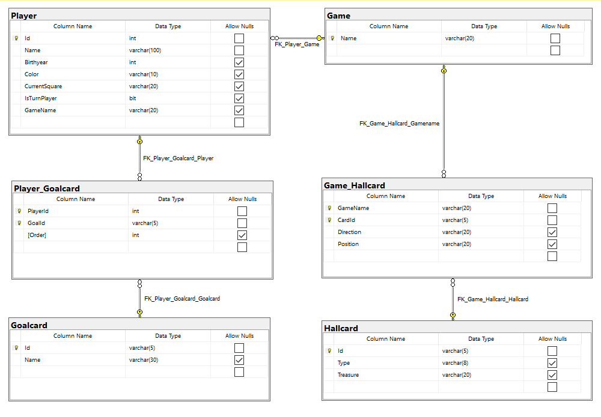

# Workshop - Data Definition Language
In this workshop you'll learn how to:
- Create a database;
- Drop a database;
- Create tables;
- Alter tables;
- Drop tables;

## Prerequisites
- SQL Server 2017+ Installed;
- **S**QL **S**erver **M**anagement **S**tudio Installed;
- Since we'll be creating our own databases, there is no database required for this workshop.

## Exercise 1
Recreate the following database called `Game_db` based on the following schema:

### Steps to accomplish this exercise:
1. Create a database named `Game_db`, then refresh your object explorer in SQL Management Studio so that the database is visible. Then execute the statement `USE Game_db` to make the database active as the default database.
2. Create the `Game` table.
3. Create the `Goalcard` table.
4. Create the `Hallcard` table.
5. Create the `Player` table
    - The `Id` column is automagically determined by the database engine
    -  Make sure to add a `constraint` called `CH_Player_Colors` so that the `Player` can only choose a `red` or `black` color.
6. Create the `Game_Hallcard` table.
7. Create the `Player_Goalcard` table.
8. Add an extra column `Email` to the `Player` entitytype, which is a `VARCHAR` of max. 50 characters long.
9. Adjust the column `Email` from the `Player` entity type to a maximum length of 100 characters.
10. Add an extra column `Phonenumber` to the `Player` entity type, which entitytype would be a good fit?
11. Remove the column `Phonenumber` fron the `Player` entity type since we don't need it anymore.

## Exercise 2
Given the following Relational Model:
- Employee(<ins>Id</ins>, Name, Email)
- Project(<ins>Name</ins>, Description, StartDate, EndDate)
- Allocation(<ins>EmployeeId, ProjectName</ins>, HoursWorked) 
    - IR: EmployeeId References Employee(Id), mandatory
    - IR: ProjectName References Project(Name), mandatory

Complete the following tasks, you have to decide on the datatypes if they're not given.
Create a new database to start creating some tables.

1. Create the table `Employee`
    - IR: `Id` is created by the database engine.
    - IR: `Name` is required.
    - IR: `Email` is unique and required.
2. Create the table `Project`
    - IR: `BeginDate` should always we smaller or equal to the `EndDate`.
    - IR: `Name` should only contain [alphanumeric characters](https://whatis.techtarget.com/definition/alphanumeric-alphameric).
3. Create the table `Allocation`
    - The default for `HoursWorked` is 3.
    - If a `Project` is deleted, so should the `allocation(s)`.
    - If an `Employee` is deleted, so should the `allocation(s)`.
4. Write an `ALTER` statement removing the `constraint` which ensures that `Email`s must be unique in the `Employee` table.

## Deep Dive:
1. Why is it sometimes better to embrace certain table/column/... names like `Name`, `Type`, `Order`, etc. with square brackets like the following `[Name], [Type], [Order]` ?

### Solution
A possible solution for these exercises can be found [here](solutions/ddl.md).
