# Workshop - Data Warehousing
In this workshop you'll learn how to design, extract, transform and load a datawarehouse using SQL Server Data Tools(SSDT) and SQL Server Integration Services(SSIS). At the end of this workshop you'll be able to run background jobs to update the datawarehouse.

## Prerequisites
- SQL Server 2017+ Installed;
- **S**QL **S**erver **M**anagement **S**tudio Installed;
- **S**QL **S**erver **D**ata **T**ools Installed;
- **S**QL **S**erver **I**ntegration **T**services Installed;
- A running copy of the database **AdventureWorks2014**.
- If you've followed the [installation guide](/docs/installation.md) everything should be ready to go.

## Quick Links
- [Getting started](#getting-started)
- [Setting up the Connections Managers](#setting-up-the-connections-managers)
- [Extract data](#extract-data)
    - [Clearing the dimensions](#clearing-the-dimensions)
    - [Filling the dimensions](#filling-the-dimensions)
    - [Filling the facts](#filling-the-facts)
- [Test your flow](#test-your-flow)
- [Loading data from a .csv file](#loading-data-from-a-csv-file)

## Getting started
1. Create a new database called `AdventureWorksDW`;
2. Create the following tables using the scripts below
    - DimSalesTerritory
    - DimDate
    ```sql
    CREATE TABLE [DimSalesTerritory]
    (
        [SalesTerritoryKey] INT NOT NULL,
        [SalesTerritoryRegion] NVARCHAR(50) NOT NULL,
        [SalesTerritoryCountry] NVARCHAR(50) NOT NULL,
        [SalesTerritoryGroup] NVARCHAR(50) NOT NULL,
        CONSTRAINT PK_DimSalesTerritory PRIMARY KEY([SalesTerritoryKey])
    )
    ```
    ```sql
    CREATE TABLE [DimDate] 
    (
        [DateKey] INT NOT NULL,
        [FullDateAlternateKey] DATE NOT NULL,
        [EnglishDayNameOfWeek] NVARCHAR(50) NOT NULL,
        [DutchDayNameOfWeek] NVARCHAR(50) NOT NULL,
        [MonthNumber] TINYINT NOT NULL,
        [EnglishMonthName] NVARCHAR(50) NOT NULL,
        [DutchMonthName] NVARCHAR(50) NOT NULL,
        [CalendarQuarter] TINYINT NOT NULL,
        [CalendarYear] SMALLINT NOT NULL
        CONSTRAINT PK_DimDate PRIMARY KEY(DateKey)
    )
    ```
3. Prepare the extraction of the data by creating 2 VIEWs in the `AdventureWorks2014` database, we'll be using these views later on so it's a good idea to get to know the inner workings of that the VIEWs represent. Execute the following statements:
    ```sql
    CREATE VIEW VwSalesTerritory AS
    SELECT
    SalesTerritory.TerritoryID AS SalesTerritoryKey
    ,SalesTerritory.[Name]		AS SalesTerritoryRegion
    ,CountryRegion.[Name]		AS SalesTerritoryCountry
    ,SalesTerritory.[Group]		AS SalesTerritoryGroup
    FROM Sales.SalesTerritory SalesTerritory 
        JOIN Person.CountryRegion CountryRegion on SalesTerritory.CountryRegionCode = CountryRegion.CountryRegionCode;
    ```
    ```sql
    CREATE VIEW VwDimDate AS
    SELECT DISTINCT
    CAST(FORMAT(OrderDate,'yyyyMMdd') AS INT) AS DateKey
    ,OrderDate AS FullDateAlternateKey
    ,FORMAT(OrderDate,'dddd','en-UK') AS EnglishDayNameOfWeek
    ,FORMAT(OrderDate,'dddd','nl-NL') AS DutchDayNameOfWeek
    ,MONTH(OrderDate) AS MonthNumber
    ,FORMAT(OrderDate,'MMMM','en-UK') AS EnglishMonthName
    ,FORMAT(OrderDate,'MMMM','nl-NL') AS DutchMonthName
    ,DATEPART(q,OrderDate) AS CalendarQuarter
    ,DATEPART(YYYY,OrderDate) CalendarYear
    FROM Sales.SalesOrderHeader
    WHERE OnlineOrderFlag = 1
    ```
4. Create a new `Integration Services Project` using Visual Studio 2017+ called `AdventureWorks`.
    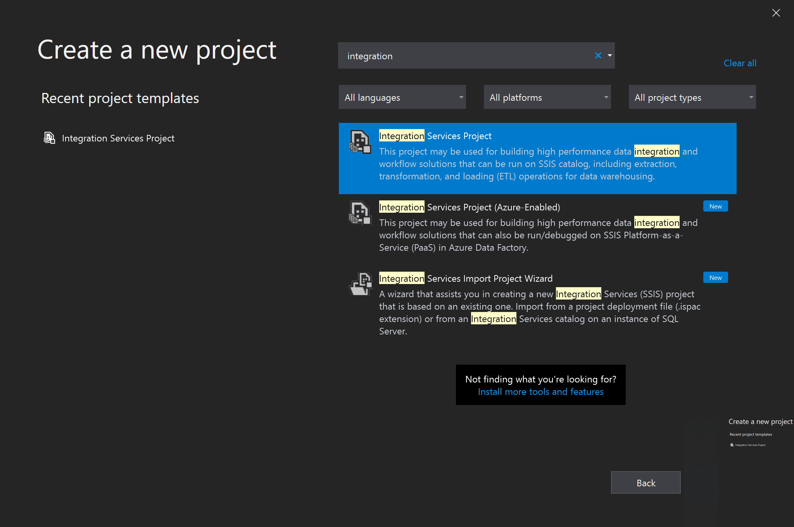
    > If the `Integration Services Project` option is not available, make sure to revisit the steps in the [installation guide](/docs/installation.md).
5. Right click on `package.dtsx` in the solution explorer to rename it to `FillDW.dtsx`
    > Deep Dive : The `.dtsx` extension is a shorthand for `Data Transformation Service`, the former name of SSIS. The Data Transformation Services Package XML (DTSX) file format is an XML-based file format that stores the instructions for the processing of a data flow, including transformations and optional processing steps, from its points of origin to its points of destination, [learn more](https://docs.microsoft.com/en-us/openspecs/sql_data_portability/ms-dtsx/806ed920-d25a-4a0e-b54d-628c689e4c2b).
    
## Setting up the Connections Managers 
Configure two `Connection Managers` one which connects to the newly created `AdventureWorksDW` and one which connects to the OLTP `AdventureWorks2014`. This will allow you to re-use connections in multiple packages and steps. Take the following actions:
1. In the solution explorer, right click on `Connection Managers`, select `New Connection Manager`.
2. Select the `OLEDB` option and click `add`.
3. Click `New...` 
4. In the Server Name field, type `localhost` and select the `AdventureWorks2014` database.
5. Test the connection by clicking the `Test Connection` button and make sure you're able to connect to the database.
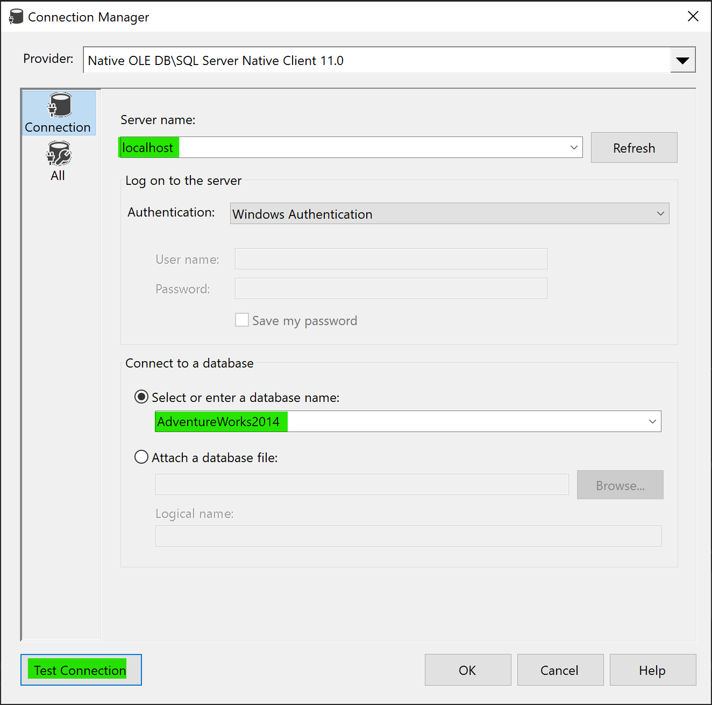
6. Repeat step 3-5 for the `AdventureWorksDW` database.

6. By now your solution should look similar to the following screenshot:
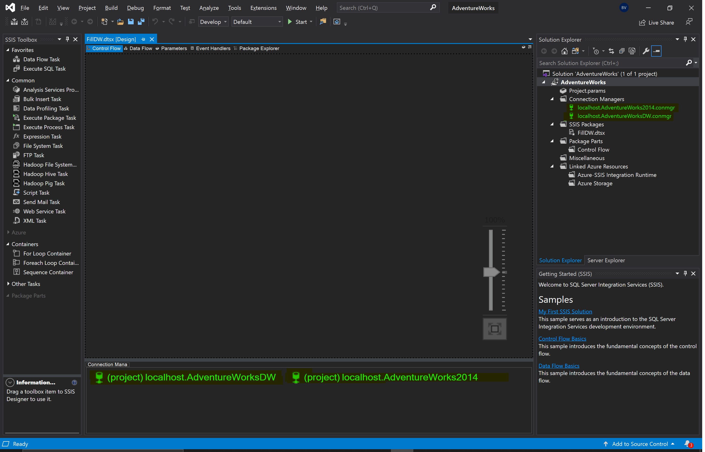

## Extract data
We want to extract data from the OLTP database `AdventureWorks2014` and load it into the data warehouse `AdventureWorksDW`, automagically based on certain criteria.

### Clearing the dimensions
Before we start filling the dimension tables of the data warehouse, we want to delete all records from the table `DimSalesTerritory` before each transfer. Therefore we need a `Execute SQL Task`. 
1. Drag the `Execute SQL Task` from the toolbox onto the `Control Flow` tab.
2. Double click the `Execute SQL Task` in the `Control Flow` and edit the fields according to the screenshot below.
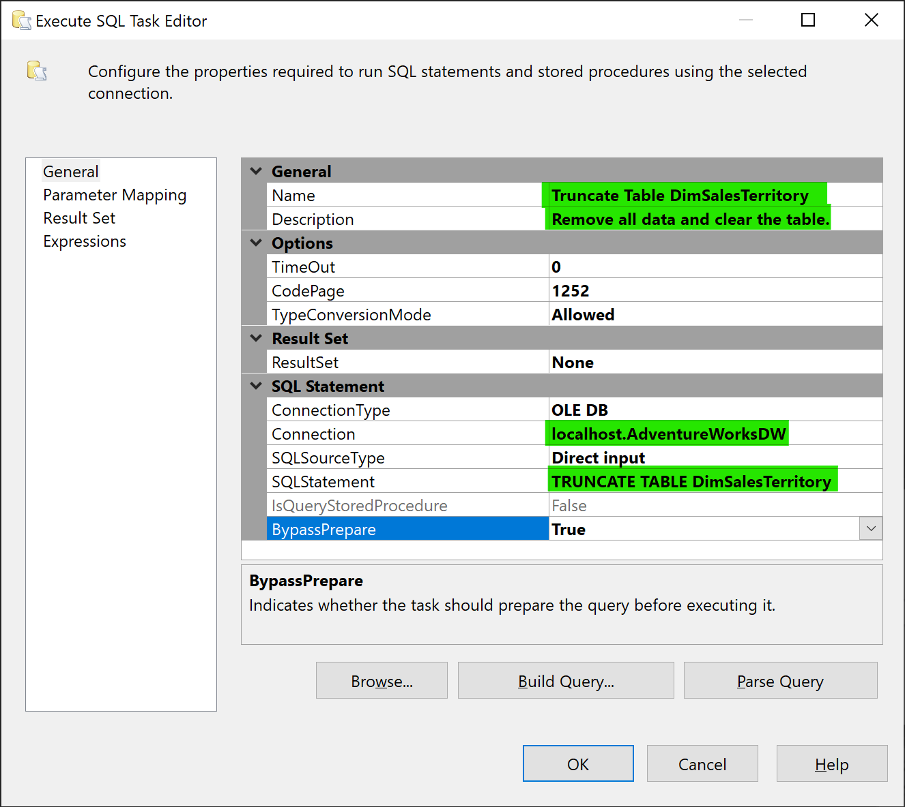.

### Filling the dimensions
Once we know the table is empty by truncating the DimSalesTerritory table, we can start stuffing it with data coming from the OLTP database `AdventureWorks2014`.

#### DimSalesTerritory
1. Drag the `Data Flow Task` from the toolbox onto the `Control Flow` tab, rename the task to `Fill Table DimSalesTerritory`.
2. Connect the preceding task, so that after a successful `DELETE` statement the `Data Flow Task` is started. You can add as many follow-ups on a failiure or successful execution. 
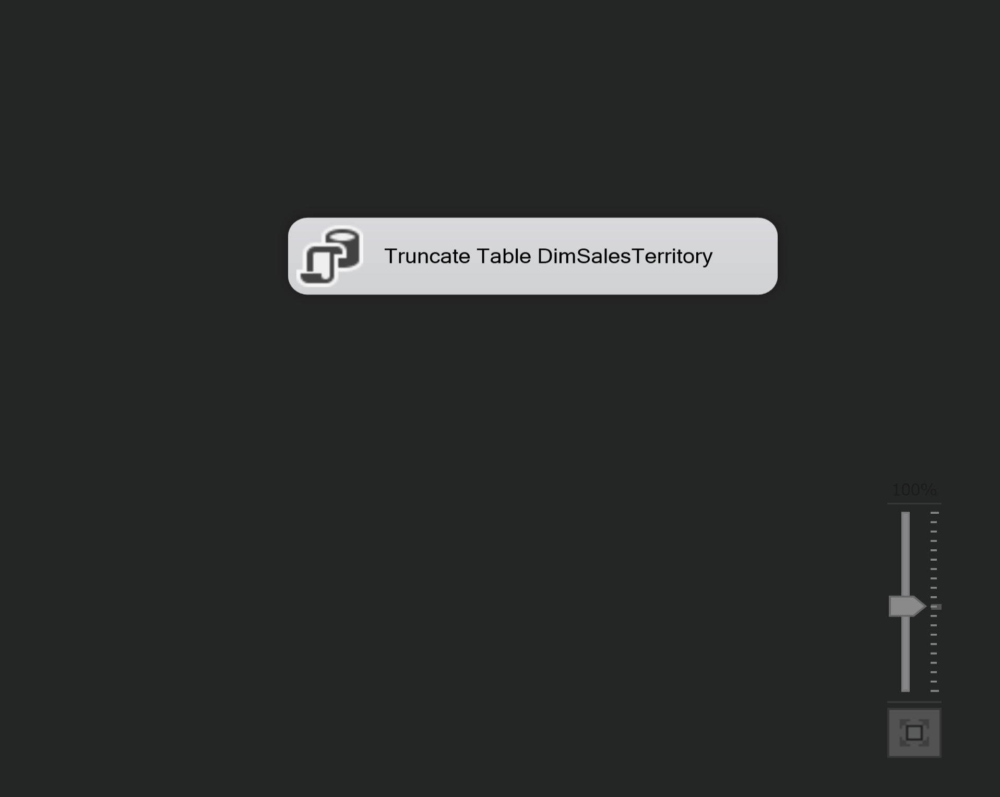.
3. Double click the `Fill Table DimSalesTerritory` task, the `Data Flow` tab is now active and selected, notice how the SSIS toolbar changed based on the selected tab `Control Flow` vs. `Data Flow`.  
4. Drag the data flow task `OLE DB Source` (Other Sources) to the data flow. Configure it as follows by right clicking the task:
    - Rename the task to `Extract SalesTerritory`.
    - Make sure the Connection Manager is set to `AdventureWorks2014`.
    - The VIEW to load the data from is `VwSalesTerritory`.
5. Drag the data flow task `OLE DB Destination`(Other Destinations) to the data flow. Afterwards connect the source to the destination. Configure it as follows by right clicking the task:
    - Rename the task to `Fill DimSalesTerritory`.
    - Make sure the Connection Manager is set to `AdventureWorksDW`.
    - The TABLE to load the data in is `DimSalesTerritory`.
6. Check the Mappings in the destination and make sure they match. 
    > **IMPORTANT :** If the name of the VIEW column(s) don't match the name of the destination table or the datatype (even NVARCHAR vs. VARCHAR) are different , you'll get errors or the columns are ignored. It's always a good idea to check the mappings and if they don't match ALTER the VIEW or TABLE, or use `CAST` or `CONVERT` functions in the VIEW.
7. Run the package by navigating to the `Control Flow` and pressing `F5` or `Start`.
8. Double check your results by writing a SQL query against the `DimSalesTerritory` table in the datawarehouse.
.

#### DimDates
For filling the `DimDate` table you'll have to do exactly the same as `DimSalesTerritory`.
1. Create a new `Data Flow Task`, give an appropriate name.
2. Add 1 OLE DB source and 1 OLE DB destination for the corresponding view and table.
3. Create a connection between the source and the destination.
4. Don't forget to delete all the records from the `DimDate` table. If you forgot why you need to do this, [re-read the section about it](#clearing-the-dimensions).
5. Check your results by running the package again and query the filled table `DimDate`.
6. Control flow at this point:
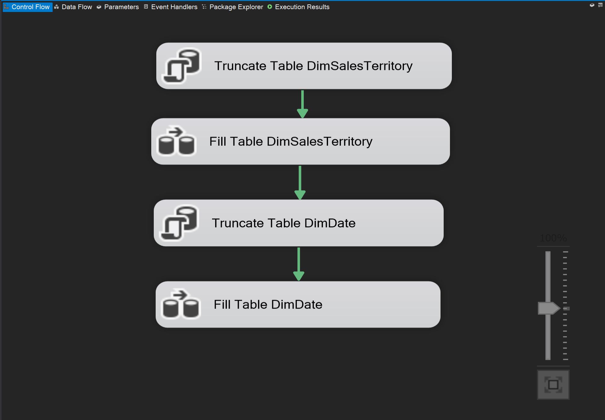
7. Data flow `Fill Table DimDate` at this point:
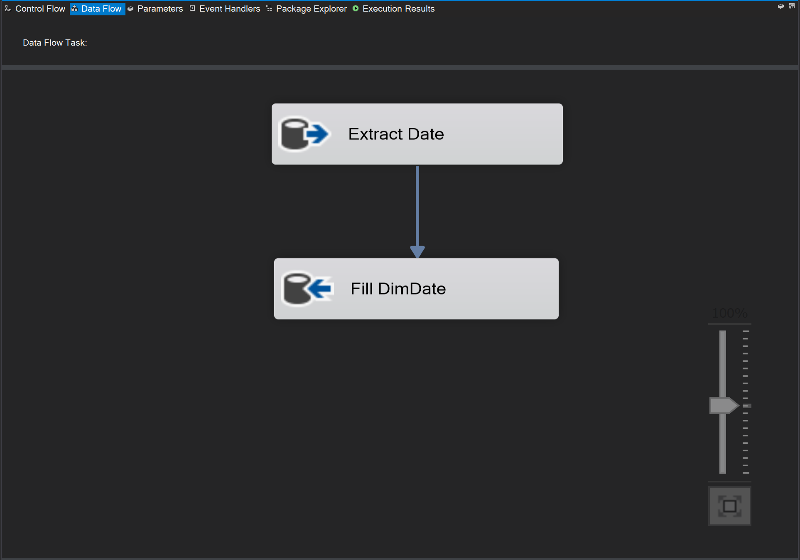

#### DimProduct
The product dimension or the `DimProduct` table is a bit different then the `DimDate` and `DimSalesTerritory` dimensions. We'll be keeping track of product history in this dimensions, also known as a `slowly changing dimension`. 
1. Create the `DimProduct` table in the datawarehouse based on the following relational model, the `ProductKey` column is automagically generated by the database engine.
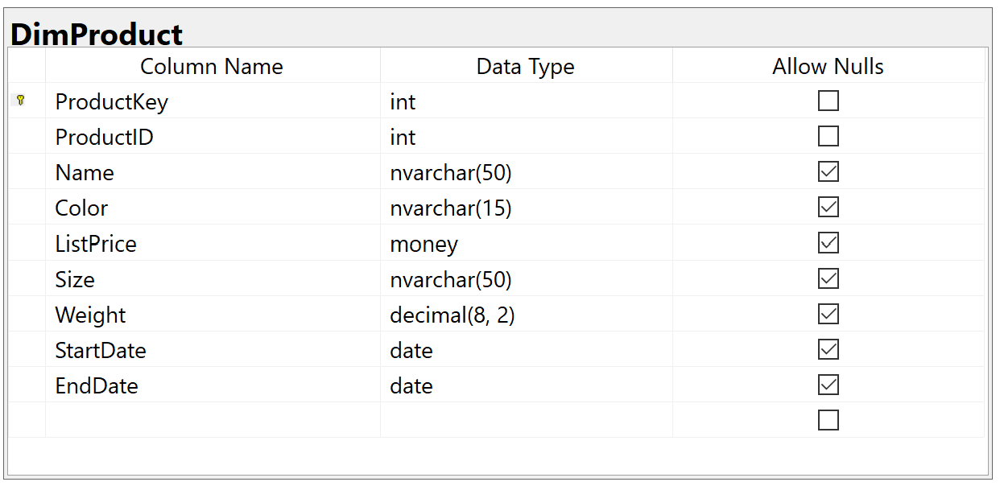
2. On the `Control Flow` add a new `Data Flow Task` called `Fill Table DimProduct(SCD)`, notice that we do **not** add a `Truncate Table` or `Delete` command since we'll be keeping history.
3. Add a `OLE DB Source` task, with the name `Extract Product`. Make sure the `Production.Product` table from the OLTP database `AdventureWorks2014` is selected.
4. Add a `Slowly Changing Dimension` task, with the name `Fill DimProduct(SCD)`.
5. Connect the `Extract Product` task to the `Fill DimProduct(SCD)`.
6. Right click the `Fill DimProduct(SCD)` and select `Edit`, which will start a Slowly Changing Dimension wizard. In the wizard take the following actions based on the provided screenshots, make sure to read the given information to understand what's going on:
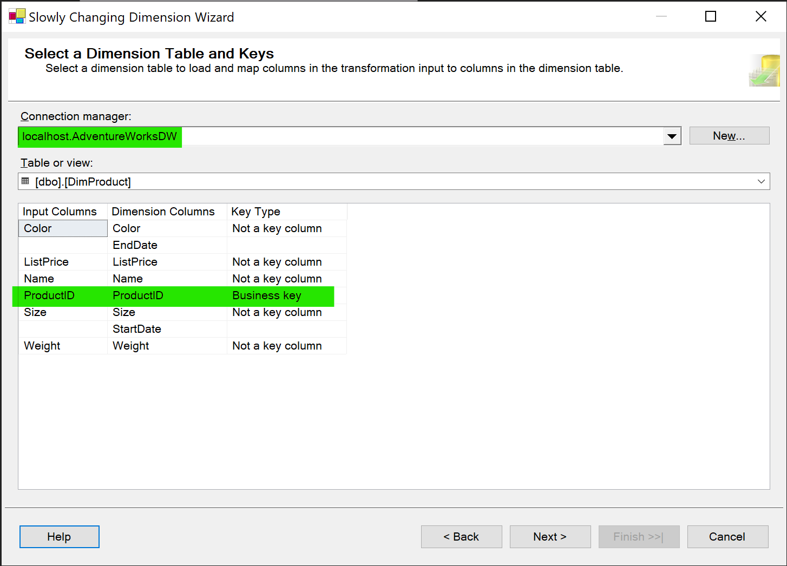
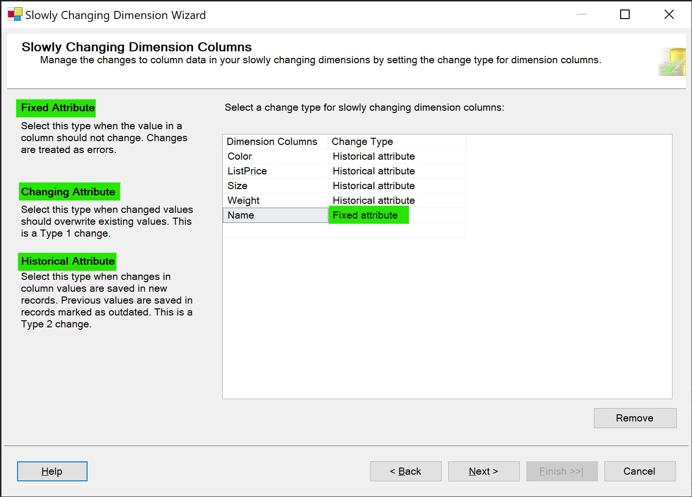
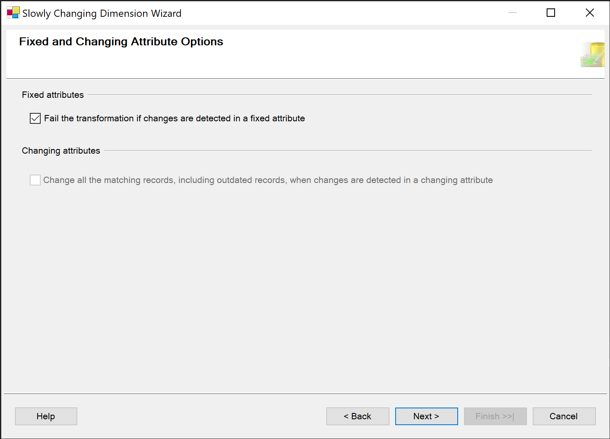
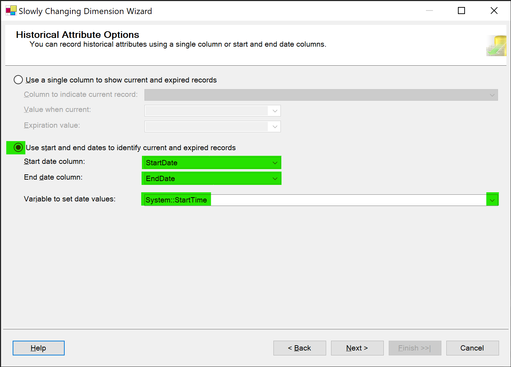
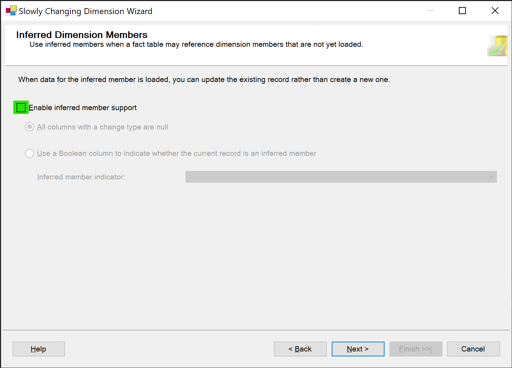
7. The generated `Data Flow` is the following, make sure to check what each task does by right clicking the task and pressing `Edit`, you *can* give each task a appropriate name:
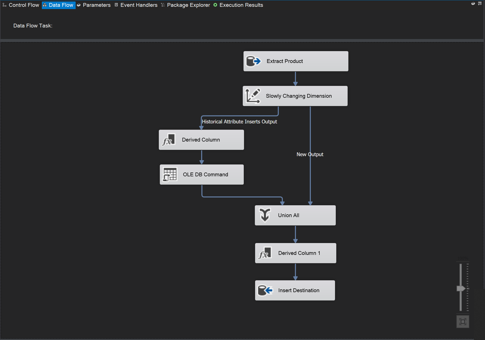
8. By default SSIS set the `EndDate` equal to the new start date. It seems more appropriate to set the `EndDate` to yesterday (the day before the SSIS runs if we would schedule the package on a daily basis) and the new start date to today. Double click `Derived Column` and change the `Expression` field as follows:

    `DATEADD("day",-1,(DT_DBDATE)(@[System::StartTime]))`
9. Run the project and check the results.
    - `DimProduct` is filled but the StartDate is equal to today. From a business point of view this is essentially wrong, the current product data is valid since the start of the company (since we have no history yet). So execute the following statement once:
    ```sql
    UPDATE DimProduct 
    SET StartDate = 
    (
        SELECT MIN(OrderDate) 
        FROM AdventureWorks2014.Sales.SalesOrderHeader
    );
    ```
10. Check what happens when -for example- the color of a product is updated and you rerun the package, take the following steps:
    1.	On the OLTP database, execute the following command 
        ```sql
        UPDATE Production.Product SET Color = 'Blue' WHERE ProductID = 776;
        ``` 
    2.	Rerun the package
    3.	On the datawarehouse, execute the following command
        ```sql
        SELECT * FROM DimProduct WHERE ProductID = 776;
        ```
    4. What's the result?

### Filling the facts
1. Create the `FactSales` table in the datawarehouse based on the following relational model, the `SalesOrderLineNumber` column is **not** automagically generated by the database engine. Since the column has no real busniness meaning and is a surrogate key in the OLTP database, we'll re-use it's values in the datawarehouse.
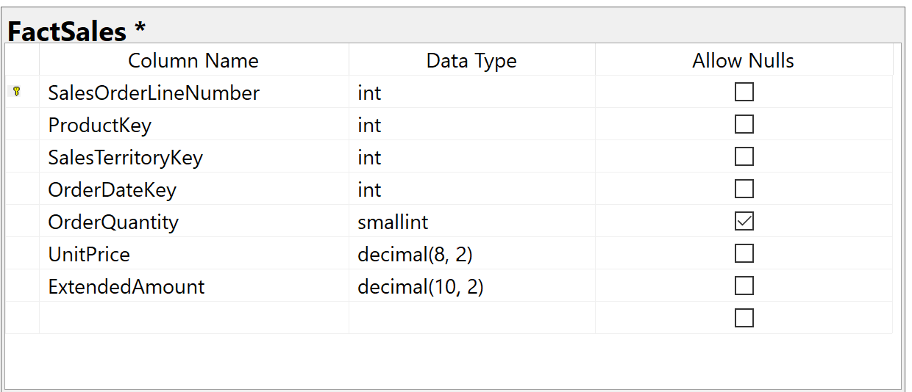
    > **Remarks**
    > - `ProductKey` (and not `ProductID`, which is kept as a business key) is inserted as foreign key so we can also link to the correct `Product` information when making sales reports. 
    > - The first where clause makes sure that we join with the correct `DimProduct` line so we can insert the correct `ProductKey` due to the `slowly changing dimension`. 
    > -	Due to the second where clause we only add new lines to `FactSales` in consecutive runs of this statement. The `ISNULL` function is necessary for the first run (when FactSales is empty) because `SELECT MAX()` returns `NULL` on an empty table. 
2. Distinguish which columns are foreign keys and which are real fact columns based on the name of the columns, we'll be adding them later using the Database Diagram.
3. Now we can start inserting facts based on the OLTP database into the data warehouse, add a new `Execute SQL Command Task` in the `control flow` and connect it to the last task `Fill Table DimProduct(SCD)` with the name `Fill Table FactSales` afterwards press right click the on the new task and press `edit`. In this dialog connect to the data warehouse and copy-paste the following insert statement into the `SQLStatement field`:
    ```sql
    INSERT INTO FactSales
    (
    -- Columns we're inserting into.
    SalesOrderLineNumber
    ,ProductKey
    ,SalesTerritoryKey
    ,OrderDateKey
    ,OrderQuantity
    ,UnitPrice
    ,ExtendedAmount
    )
    SELECT 
     d.SalesOrderDetailID
    ,p.ProductKey
    ,h.TerritoryID
    ,CAST(FORMAT(h.OrderDate,'yyyyMMdd') AS INT)
    ,d.OrderQty,d.UnitPrice
    ,d.OrderQty * d.UnitPrice
    FROM AdventureWorks2014.Sales.SalesOrderHeader h 
        JOIN AdventureWorks2014.Sales.SalesOrderDetail d ON h.SalesOrderID = d.SalesOrderID
        JOIN DimProduct p ON d.ProductID = p.ProductID
    WHERE 
    /* Slowly Changing Dimension dimproduct */
    h.OrderDate >= p.StartDate AND (p.EndDate IS NULL OR h.OrderDate <= p.EndDate)
    AND /* increment, also make sure it runs from an empty factsales table */
    d.SalesOrderDetailID > (SELECT ISNULL(MAX(SalesOrderLineNumber),0) FROM factsales);
    ``` 
    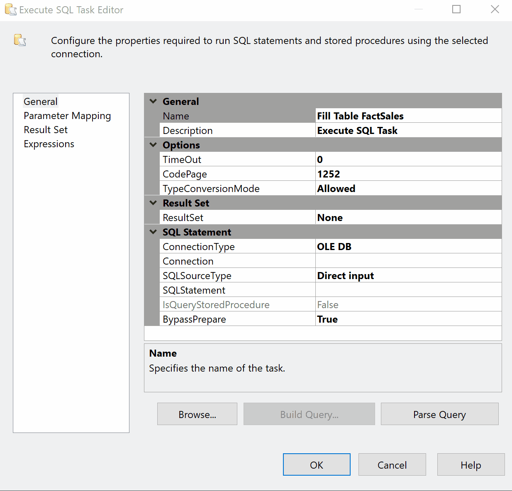

4. Draw the `Database Diagram` of the data warehouse and connect the foreign keys as shown in the .gif.
> **IMPORTANT** Do not forget to save the diagram and the changes you made to the foreign keys, else it the contraints won't be added.


5. Run the project as a whole and check the resulting tables. We get an error message because we are trying to delete `DimDate` and `DimSalesTerritory` since there are foreign key constraints between those tables and the `FactSales` table. One way to cope with this is to temporarily disable the constraints at the start of the fill operation and enable them again at the end. So add two `Execute SQL ` tasks in the control flow, don't forget to select the `Connection Manager` for the datawarehouse.
    1. At the start
        ```sql 
        ALTER TABLE FactSales NOCHECK CONSTRAINT ALL;
        ```
    2. At the end
        ```sql
        ALTER TABLE FactSales WITH CHECK CHECK CONSTRAINT ALL;
        ```
        > `CHECK CHECK` is not a typo.

## Test your flow
As a final test we can add a sales line for an updated product in the operational system and check if the corresponding `FactSales` line in the datawarehouse will be linked to the correct `ProductKey` in `DimProduct`:

1. Copy the last line from [Sales].[SalesOrderHeader] (SalesOrderID is an identity column, so we have to specify all fields)
    ```sql
    INSERT INTO [Sales].[SalesOrderHeader]
            ([RevisionNumber],[OrderDate],[DueDate],[ShipDate],[Status],[OnlineOrderFlag],[PurchaseOrderNumber]
            ,[AccountNumber],[CustomerID],[SalesPersonID],[TerritoryID],[BillToAddressID],[ShipToAddressID]
            ,[ShipMethodID],[CreditCardID],[CreditCardApprovalCode],[CurrencyRateID],[SubTotal]
            ,[TaxAmt],[Freight],[Comment],[rowguid],[ModifiedDate])
    select s.RevisionNumber,'2020-03-08', '2020-03-08', '2020-03-08',s.Status,
    s.OnlineOrderFlag,s.PurchaseOrderNumber,s.AccountNumber,s.CustomerID,
    s.SalesPersonID,s.TerritoryID,s.BillToAddressID,s.ShipToAddressID,
    s.ShipMethodID,s.CreditCardID,s.CreditCardApprovalCode,s.CurrencyRateID,
    s.SubTotal,s.TaxAmt,s.Freight,s.Comment,newid(),getdate()
    from sales.salesorderheader s
    where salesorderid = (select max(salesorderid) from sales.salesorderheader);
    ```
2. Check for the key value to use in [Sales].[SalesOrderDetail]:
    ```sql
    select max(salesorderid) from sales.salesorderheader; --> 75129
    ```
3. Add a line to the above created `SalesOrderHeader`:
    ```sql
    INSERT INTO [Sales].[SalesOrderDetail]([SalesOrderID],[CarrierTrackingNumber],[OrderQty],[ProductID]
            ,[SpecialOfferID],[UnitPrice],[UnitPriceDiscount],[rowguid],[ModifiedDate])
        VALUES (75129,null,4,776,1,10,0,newid(),getdate());

    ```
4. Now rerun the package and check `FactSales`:
    ```sql
    select * from dimproduct where productid = 776;
    ```
    > 506 is the correct product key.
    ```sql
    select top 1 * from factsales order by salesorderlinenumber desc;
    ```
    > 506 should be linked in this fact.

## Loading data from a csv file
1.	Create a new SSIS package; name it `Transfer Country Data`. 
2.	Create the destination table for this example by running the following script on the AdventureWorksDW database:
    ```sql
    CREATE TABLE [country](
        [id] [int] IDENTITY(1,1) NOT NULL,
        [name] [varchar](150) NOT NULL,
        [alpha-2] [varchar](50) NULL,
        [alpha-3] [varchar](50) NULL,
        [country-code] [varchar](50) NULL,
        [iso_3166-2] [varchar](50) NULL,
        [region] [varchar](50) NULL,
        [sub-region] [varchar](50) NULL,
        [region-code] [varchar](50) NULL,
        [sub-region-code] [varchar](50) NULL,
        CONSTRAINT [PK_country] PRIMARY KEY ([id] ASC)
    );
    ```
3.	Drag-and-drop a Data Flow Task from SSIS Toolbox into the package designer. Double-click on the task. You will be redirected to a new tab named Data Flow. 
4.	In the Data Flow tab, drag-and-drop a flat file source from SSIS Toolbox into the Package Designer. Then, double-click on the flat file source. 
5.	In Flat File Source Editor, create a new connection. After this step, the Flat File Connection Manager menu will be opened.
6.	Browse for the Country.csv file, and leave the locale and code page configurations as is. Verify the Format field to be set as Delimited, as the next screenshot shows, and check the box that says Column names in the first data row:
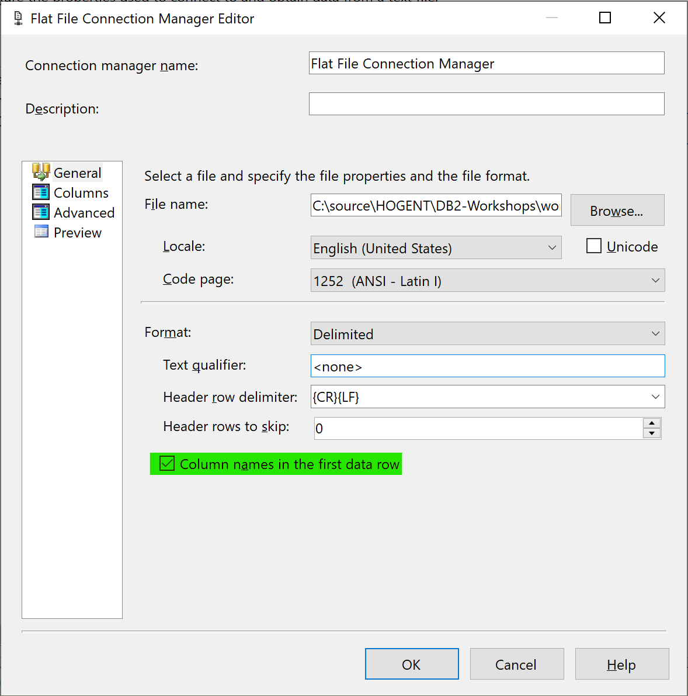
7.	Go to the Columns tab and you will see how columns are recognized by the settings that we made in the General tab. You can also change the row and column delimiters in this tab.
8.	The Advanced tab shows detailed information about each column; you can set the data type, length, and some other properties for each column in that tab. Finally, you can view the data rows as they are processed in the flat file source's connection manager in the Preview tab. Do not change anything in the Advanced tab and click on OK.
9.	In the Flat File Source Editor, set the Retain null values from the source option as null values in the Data Flow.
10.	Go to the Columns tab; here, you can check as many columns as you want to be fetched from the source. By default, all columns will be fetched. Leave it as is and close the Flat File Source Editor.
11.	Now, add an OLE DB destination and connect to the Flat File Source. Configure the Destination for the country table from the AventureWorksDW database. Check the Columns tab to verify all corresponding fields are linked.
12.	Run the package and check the table country.

## Solutions to DWH exercises on EntertainmentAgency
You find [here](dwh_solutions.sql) the solutions to the DWH EntertainmentAgency Exercises on both OLTP & DWH, including the statement
to fill the fact table. 
You find [here](dwh_creates.sql) the create statements for the fact and dimension tables of the DWH EntertainmentAgency Exercise. 


## Further Reading
You can get more information about SSIS by reading the [official documentation](https://docs.microsoft.com/en-us/sql/integration-services/sql-server-integration-services?view=sql-server-ver15) provided by Microsoft.


