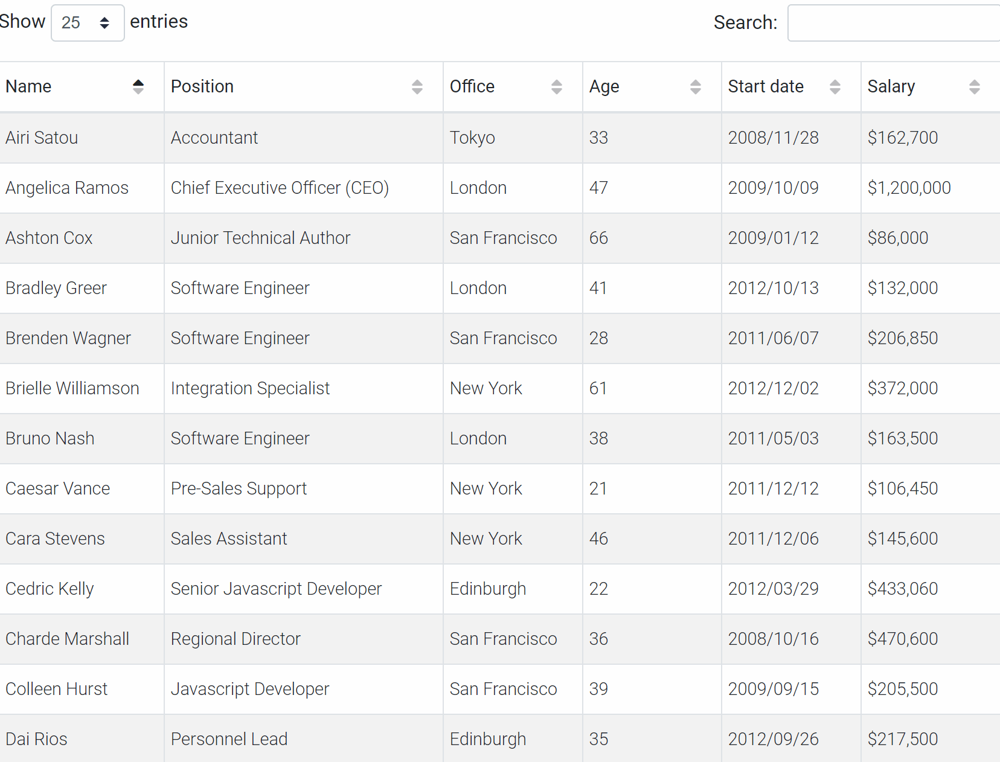

# Workshop - Dynamic SQL
In this workshop you'll learn how to write flexible SQL statements.

## Prerequisites
- SQL Server 2017+ Installed;
- **S**QL **S**erver **M**anagement **S**tudio Installed;
- A running copy of the database **xtreme**.
- Completed the following workshops:
    - [Stored procedures](/workshops/stored-procedures/stored-procedures.md)
    - [Cursors](/workshops/cursors/cursors.md)

## Use Dynamic SQL with caution
- As a developer you have to make sure there cannot be any form of fraudulous SQL Injection while using this feature.
- Due to recompilation and late binding the performance of Dynamically constructed queries *can* be rather poor.

## Exerise 1
In a lot of business applications a user is shown a table of data. Which in most cases is a selected list of columns from a table in the SQL database. However sometimes a user wants to `sort` the data as he wishes. To solve this problem and give the user more flexibility we can create a dynamic SQL statement. The end goal is that a user can choose how many rows he wants to see, on which column the data has to be sorted and in which direction (`ascending or descending`). An example can be seen in the screenshot below.


> Note that the screenshot is not using the data of the database `xtreme`.

### Call to action
1. Write a `stored procedure` called `USP_CustomerIndex`, which takes 3 parameters as input.
    - a parameter to supply the amount of rows the user wants, by default it's `10`
    - a parameter to specify which column the user can order/sort the resultset on, by default it's `CustomerId`.
    - a parameter to specify which order/sort direction (`ASC` or `DESC`) the resultset should be sorted by, if none is given, `ASC`
2. In the aforementioned stored procedure, query the `customer` table, and show 6 columns:
    - CustomerID
    - CustomerName
    - Address
    - PostalCode
    - Country
    - Email
3. It's time to make the query more dynamic, declare a new variable called `sql` of datatype `NVARCHAR(MAX)`. 
4. `SET` the value of the variable `sql` to the query you made in step 2.
    > Don't forget the single quotes, since the variable is of type `NVARCHAR(MAX)`.
5. In the `sql` variable add an `ORDER BY` clause which uses the variables which you declared in step 1.
6. To limit the amount of rows the user is retrieving you can use a `TOP(x)` clause, an example can be seen below, but make sure to change the hardcoded or -in IT terms "the magic number"- `10` to the variable you specified in step 1.
    ```sql
    SELECT TOP(10) * FROM YourAwesomeTable
    ```
7. Use the `EXECUTE (@sql)` statement to query your dynamic SQL.
8. However your stored procedure is currently vulnerable to `SQL injection attacks`, make sure you check the input parameters on valid values
    - The amount of rows to retrieve cannot be negative or zero, else `throw` with a clear error message.
    - The only columns a user can order by on are `CustomerId`, `CustomerName` and `PostalCode`, if something else is provided... `throw` with a clear error message.
    - The sort direction cannot be anything else then `ASC` or `DESC`, else `throw` with a clear error message

### Execution
Make sure the following code can be executed:

```sql
EXECUTE USP_CustomerIndex 50, 'CustomerName', 'DESC';
```

### Tips
1. The statement before the [THROW](https://docs.microsoft.com/en-us/sql/t-sql/language-elements/throw-transact-sql?view=sql-server-ver15) statement must be followed by the semicolon `;` statement terminator.
2. Use `FORMATMESSAGE` to create your dynamic SQL query in a `NVARCHAR(MAX)` variable, which makes it possible to use string interpolation.
3. `SELECT * FROM Table ORDER BY @variable` does **not** work, put your dynamic query in a variable.
4. To check if a variable is valid you can use an `IF` statement
    ```sql
    IF @amount <= 0
    BEGIN; -- Mind the semicolon here (tip 1.)
        THROW 50000, 'Invalid parameter for @SortDirection', 1
        RETURN -1;
    END;
    ```

### Result Sets
The following statements provide the corresponding input
```sql
EXECUTE USP_CustomerIndex
```
|CustomerID|CustomerName                 |Address|PostalCode                                   |Country|Email                    |
|----------|-----------------------------|-------|---------------------------------------------|-------|-------------------------|
|1         |City Cyclists                |7464 South Kingsway|48358                                        |USA    |Christianson@bba.com     |
|2         |Pathfinders                  |410 Eighth Avenue|60148                                        |USA    |Manley@arubasport.com    |
|3         |Bike-A-Holics Anonymous      |7429 Arbutus Boulevard|43005                                        |USA    |Jannis@downunderbikes.com|
|4         |Psycho-Cycle                 |8287 Scott Road|35818                                        |USA    |Mast@canbikes.com        |
|5         |Sporting Wheels Inc.         |480 Grant Way|92150                                        |USA    |Reyess@kangerootrikes.com|
|6         |Rockshocks for Jocks         |1984 Sydney Street|78770                                        |USA    |Davis@brucebikes.com     |
|7         |Poser Cycles                 |8194 Peter Avenue|55360                                        |USA    |Smith@peddlesofperth.com |
|8         |Spokes 'N Wheels Ltd.        |3802 Georgia Court|50305                                        |USA    |Chester@koalaroad.com    |
|9         |Trail Blazer's Place         |6938 Beach Street|53795                                        |USA    |Burris@devilbikes.com    |
|10        |Rowdy Rims Company           |4861 Second Road|91341                                        |USA    |Shoemaker@piccolobike.com|


```sql
EXECUTE USP_CustomerIndex 3, 'customername', 'ASC'
```
|CustomerID|CustomerName          |Address                   |PostalCode|Country|Email                   |
|----------|----------------------|--------------------------|----------|-------|------------------------|
|132       |7 Bikes For 7 Brothers|52779 Xavier Boulevard    |89102     |USA    |Cogswell@tlmonterrey.com|
|133       |Against The Wind Bikes|5302 Freedom Way          |14817     |USA    |Davis@ucycle.com        |
|231       |AIC Childrens         |303-404 Pricecess Building|439433    |China  |Yuen@tearsforgears.com  |

```sql
EXECUTE USP_CustomerIndex 10, 'customername', 'WRONGDIRECTION'
```

```sql
Msg 50001, Level 16, State 2, Procedure USP_CustomerIndex, Line 13 [Batch Start Line 0]
Invalid parameter for @SortDirection
```

```sql
EXECUTE USP_CustomerIndex NULL, 'customername', 'asc'
```

```
Msg 50000, Level 16, State 1, Procedure USP_CustomerIndex, Line 9 [Batch Start Line 0]
Invalid parameter for @amount
```

```sql
EXECUTE USP_CustomerIndex 5;
```

|CustomerID|CustomerName           |Address               |PostalCode|Country|Email                    |
|----------|-----------------------|----------------------|----------|-------|-------------------------|
|1         |City Cyclists          |7464 South Kingsway   |48358     |USA    |Christianson@bba.com     |
|2         |Pathfinders            |410 Eighth Avenue     |60148     |USA    |Manley@arubasport.com    |
|3         |Bike-A-Holics Anonymous|7429 Arbutus Boulevard|43005     |USA    |Jannis@downunderbikes.com|
|4         |Psycho-Cycle           |8287 Scott Road       |35818     |USA    |Mast@canbikes.com        |
|5         |Sporting Wheels Inc.   |480 Grant Way         |92150     |USA    |Reyess@kangerootrikes.com|


## Exercise 2
We'd like to know for every `ProductClassID` how many products are produced in.
- USA;
- Canada;
- Japan;
- UK;
- A total of all the countries combined.

A possible SQL statement that produces this output is listed below.
```sql
SELECT  Product.ProductClassID,
        SUM(CASE WHEN Supplier.Country ='USA' THEN 1 ELSE 0 end) AS 'USA',
        SUM(CASE WHEN Supplier.Country ='Canada' THEN 1 ELSE 0 end) AS 'Canada',
        SUM(CASE WHEN Supplier.Country ='Japan' THEN 1 ELSE 0 end) AS 'Japan',
        SUM(CASE WHEN Supplier.Country ='UK' THEN 1 ELSE 0 end) AS 'UK',
        COUNT(Product.productid) AS TOTAL
FROM Product 
JOIN Supplier ON Product.SupplierID = Supplier.SupplierID
GROUP BY ProductClassID
```
> Note that the `countries` are hardcoded in this statement, this can create a maintenance nightmare... Everytime a new country comes into the list we have to update the statement. We'd rather use a dynamic SQL approach so that every country is listed automagically and not only `USA`, `Canada`, ...


### Call to action
1. Rewrite the statement so that the countries are no longer hardcoded;
2. Wrap the statement in a `stored procedure` called `SP_ProductClass_By_Country_Amount`.

### Execution
Make sure the following code can be executed:

```sql
EXECUTE SP_ProductClass_By_Country_Amount;
```

### Tips
- Run the hardcoded statement to see the output;
- To know where the products are produced you have to look at the origin (country) of the supplier;
- A cursor can help to fetch all countries;
- Use dynamic SQL to create totals;
    - You can reuse parts of the given statement.

## Deep Dive
1. What are the disadvantages of using Dynamic SQL statements?
2. What is SQL Injection?
3. Can you invoke a Dynamic SQL statement in a User Defined Function(UDF)?
4. Is possible to use the datatype `VARCHAR(MAX)` instead of `NVARCHAR(MAX)` for your dynamic SQL query? 
5. Find out why the system stored procedure [sp_executesql](https://docs.microsoft.com/en-us/sql/relational-databases/system-stored-procedures/sp-executesql-transact-sql?view=sql-server-ver15#remarks) cannot be used in exercise 1 and check if we can use it in exercise 2.

## Solutions
A possible solution of for these exercises can be found [here](solutions/dynamic-sql.md)
